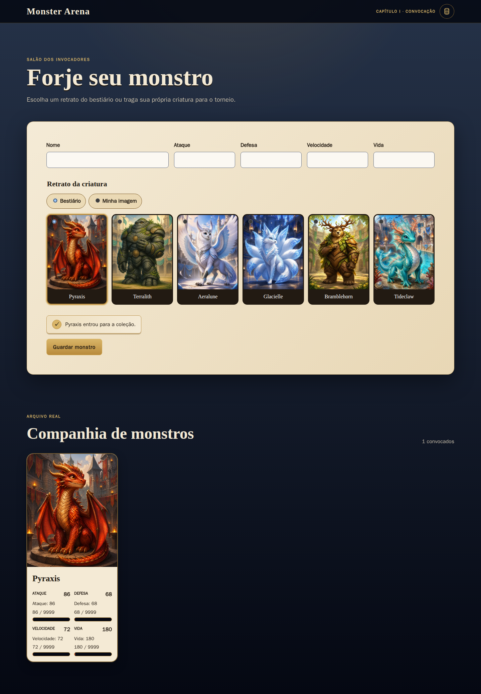
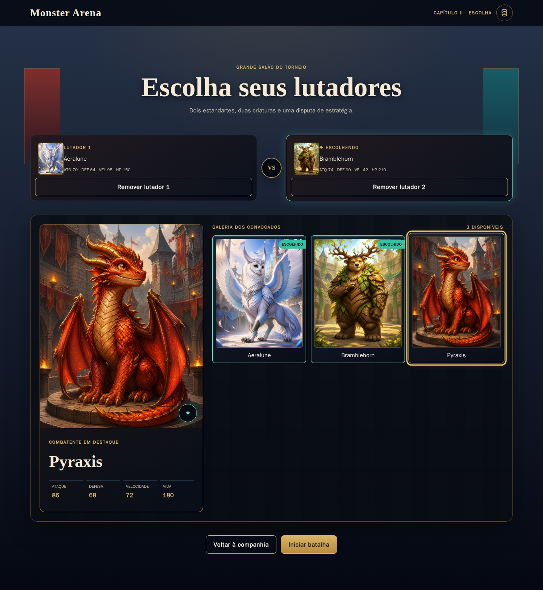
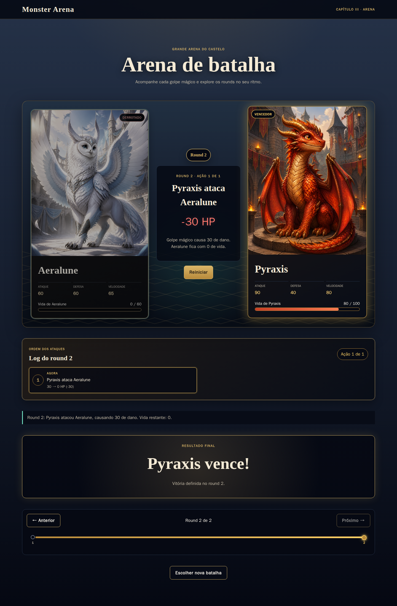
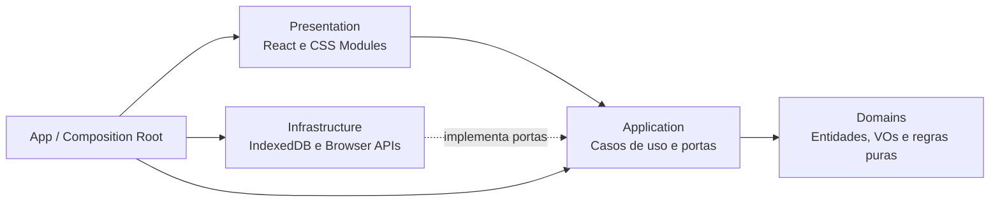
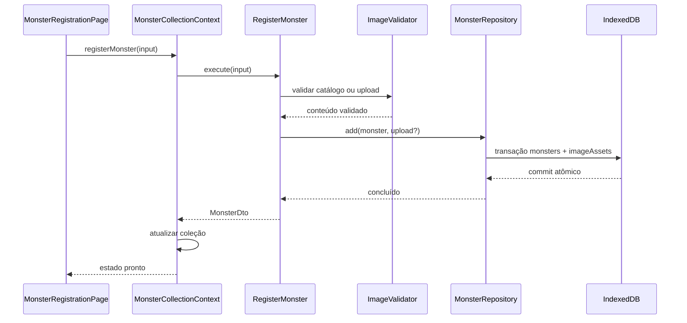

# Walkthrough técnico e funcional — Monster Arena

Este documento apresenta o Monster Arena do ponto de vista do jogador e do código. Ele pode ser usado
como roteiro de demonstração, guia de onboarding ou apoio para revisão técnica.

## 1. Visão geral

Monster Arena é uma SPA de batalha de cartas construída com React, Vite e TypeScript. O jogador pode:

1. cadastrar monstros com nome, atributos e imagem;
2. escolher uma arte do catálogo ou enviar uma imagem local;
3. selecionar dois monstros distintos;
4. calcular uma batalha completa e determinística;
5. acompanhar cada ataque em uma linha do tempo navegável;
6. limpar a coleção ou todo o banco local quando desejar.

A aplicação não possui backend. Monstros e uploads permanecem no IndexedDB do navegador e nunca são
enviados ao GitHub ou a outro servidor.

**Aplicação publicada:** <https://fbsis.github.io/react-clear-POC-SDD/>

## 2. Executar o projeto

O único pré-requisito de desenvolvimento é Docker Engine com Docker Compose 2.22 ou superior. Node.js,
pnpm, testes e build não devem ser executados diretamente no host.

```bash
docker compose up --build app
```

Abra <http://localhost:5173>. Para encerrar:

```bash
docker compose down
```

O endereço e a porta devem permanecer estáveis porque o IndexedDB é isolado por origem.

## 3. Roteiro de demonstração

Este roteiro leva aproximadamente cinco minutos.

### Etapa 1 — Cadastrar o primeiro monstro

Na tela **Forje seu monstro**, preencha:

| Campo      | Valor sugerido |
| ---------- | -------------: |
| Nome       |        Pyraxis |
| Ataque     |             90 |
| Defesa     |             40 |
| Velocidade |             80 |
| Vida       |            100 |

Mantenha **Bestiário** selecionado, escolha a arte Pyraxis e pressione **Guardar monstro**. O monstro
aparece imediatamente na companhia.

### Etapa 2 — Cadastrar o adversário

Cadastre outro monstro:

| Campo      | Valor sugerido |
| ---------- | -------------: |
| Nome       |       Aeralune |
| Ataque     |             60 |
| Defesa     |             60 |
| Velocidade |             65 |
| Vida       |             60 |

É possível escolher Aeralune no bestiário ou selecionar **Minha imagem** e enviar um JPEG, PNG ou WebP
de até 10 MB. Recarregue a página para demonstrar que a coleção e as imagens permanecem disponíveis.



### Etapa 3 — Apresentar a gestão de dados locais

No final da coleção, pressione **Gerenciar dados locais**. O modal oferece duas ações independentes:

- **Limpar monstros convocados** remove monstros e uploads, preservando o esquema do banco;
- **Limpar todo o banco de dados** exclui o IndexedDB e permite que a aplicação o recrie vazio.

As ações exigem confirmação. O modal fecha pelo botão **Fechar** ou pela tecla `Escape` e devolve o foco
ao acionador.

Não execute a limpeza durante a demonstração se quiser continuar com os dois monstros cadastrados.

### Etapa 4 — Selecionar os lutadores

Pressione **Escolher lutadores**. A tela de seleção apresenta:

- uma grade navegável por teclado;
- uma prévia ampliada do monstro em foco;
- os espaços **Lutador 1** e **Lutador 2**;
- feedback explícito para seleção e duplicidade.

Selecione Pyraxis e Aeralune e pressione **Iniciar batalha**.



### Etapa 5 — Explorar a batalha

A batalha inteira já está calculada quando a arena aparece. Na apresentação:

- **Play** começa pelo primeiro ataque e avança a cada três segundos;
- **Reiniciar** volta ao primeiro evento;
- **Pausar** interrompe a reprodução;
- **Anterior** e **Próximo** navegam entre rounds;
- a barra inferior permite saltar diretamente para outro round;
- o log mostra ações concluídas, atuais e futuras;
- o último evento revela automaticamente vencedor e derrotado.



## 4. Algoritmo de batalha

A regra principal está em
[`src/domains/battle/resolveBattle.ts`](../src/domains/battle/resolveBattle.ts). Ela é TypeScript puro e
não conhece React, timers, IndexedDB ou APIs do navegador.

### Ordem de ataque

1. maior velocidade ataca primeiro;
2. em empate de velocidade, maior ataque começa;
3. persistindo o empate, começa o monstro colocado na primeira posição.

A ordem é definida uma vez e permanece fixa durante todos os rounds.

### Dano e vida

```text
damage = max(attack - defense, 1)
hpAfter = max(hpBefore - damage, 0)
```

O dano mínimo é sempre 1 e a vida nunca fica negativa.

### Exemplo completo

Com os valores sugeridos:

1. Pyraxis começa porque `80 > 65` em velocidade.
2. Pyraxis causa `90 - 60 = 30` de dano em Aeralune.
3. Aeralune sobrevive com `60 - 30 = 30` e contra-ataca.
4. Aeralune causa `60 - 40 = 20` de dano; Pyraxis fica com 80.
5. No segundo round, Pyraxis causa mais 30 e reduz Aeralune a zero.
6. Aeralune não contra-ataca após ser derrotada.
7. Pyraxis é declarado vencedor no segundo round.

Todos esses eventos são produzidos em uma única chamada. O HP salvo dos monstros não é alterado; a
batalha trabalha com snapshots imutáveis.

## 5. Arquitetura

O projeto usa um monólito frontend modular com DDD, Clean Code e inversão de dependências.



### Camadas

| Camada           | Responsabilidade                                | Exemplos                                    |
| ---------------- | ----------------------------------------------- | ------------------------------------------- |
| `domains`        | Regras, invariantes, entities e value objects   | `Monster`, `Battle`, `CombatStats`, `Round` |
| `application`    | Orquestração, casos de uso, DTOs e interfaces   | `RegisterMonster`, `StartBattle`            |
| `infrastructure` | Integrações concretas com o navegador           | repositório IndexedDB, catálogo, UUID       |
| `presentation`   | Interface, interação e efeitos visuais          | cadastro, seleção, cards e timeline         |
| `app`            | Composição, Context API e navegação entre telas | providers e `createApplication`             |

O arquivo
[`src/app/composition-root/createApplication.ts`](../src/app/composition-root/createApplication.ts) é o
único ponto que conhece e instancia adaptadores concretos. Casos de uso recebem dependências pelo
construtor e dependem de interfaces pertencentes à camada consumidora.

## 6. Fluxo de cadastro



O formulário usa `useState` local. O `MonsterCollectionContext` mantém apenas a projeção compartilhada;
o IndexedDB continua sendo a fonte durável.

## 7. Fluxo da batalha

O caso de uso
[`src/application/battle/StartBattle.ts`](../src/application/battle/StartBattle.ts) recebe dois IDs:

1. rejeita IDs ausentes ou iguais;
2. carrega os monstros pelo `MonsterRepository`;
3. chama o resolver puro do domínio;
4. converte o agregado imutável para `BattleDto`;
5. entrega a batalha completa ao `GameSessionContext`;
6. a apresentação apenas move um cursor sobre eventos já calculados.

Timers e animações não participam da regra de negócio. O hook
[`useBattlePlayback.ts`](../src/presentation/battle-playback/useBattlePlayback.ts) agenda timeouts de três
segundos, enquanto
[`playbackReducer.ts`](../src/presentation/battle-playback/playbackReducer.ts) controla reprodução,
pausa, reinício e navegação manual.

## 8. Estado React

| Estado                          | Proprietário               | Motivo                                          |
| ------------------------------- | -------------------------- | ----------------------------------------------- |
| Dependências da aplicação       | `ApplicationContext`       | grafo estável e substituível em testes          |
| Coleção e hidratação            | `MonsterCollectionContext` | compartilhado entre cadastro e seleção          |
| Tela, lutadores e batalha atual | `GameSessionContext`       | sessão compartilhada entre telas                |
| Campos do formulário            | `useState` local           | pertence somente ao cadastro                    |
| Seleção correlacionada          | `useReducer` local         | transições explícitas e testáveis               |
| Cursor da reprodução            | `useReducer` local         | evita renderizar toda a aplicação a cada evento |

Providers expõem métodos de intenção, como `startBattle` e `registerMonster`, sem entregar setters
públicos.

## 9. Persistência

O banco `monster-arena` possui duas stores:

| Store         | Conteúdo                                       |
| ------------- | ---------------------------------------------- |
| `monsters`    | nome, atributos e referência estável da imagem |
| `imageAssets` | bytes, tipo, tamanho e nome de uploads         |

Monstro e upload são gravados na mesma transação. Se uma gravação falhar, nenhum registro parcial ou
imagem órfã permanece. Os bytes são armazenados como `ArrayBuffer`; URLs `blob:` existem apenas durante
a exibição e são revogadas no cleanup dos componentes.

O catálogo inicial fica em [`public/monster-catalog`](../public/monster-catalog) e acompanha o build.

## 10. Qualidade e testes

Execute o gate completo:

```bash
docker compose run --rm --build app pnpm check
```

O comando executa, nesta ordem:

1. verificação do Prettier;
2. ESLint com zero warnings;
3. TypeScript estrito;
4. Vitest com cobertura;
5. build de produção.

Para as jornadas reais:

```bash
docker compose up -d --build app
docker compose run --rm --build e2e pnpm test:e2e
docker compose down --volumes
```

A suíte cobre:

- invariantes de domínio e algoritmo de batalha;
- casos de uso com dependências falsas;
- contrato e integração do IndexedDB;
- componentes por comportamento observável;
- teclado, responsividade e WCAG AA com axe;
- persistência e isolamento entre sessões;
- performance de 9.999 rounds e orçamento de bundle;
- jornada completa de cadastro, seleção e batalha.

A última validação registrada passou em 41 arquivos e 122 testes unitários/integração, além de 21
jornadas locais no Chromium. O smoke test externo do Pages roda apenas depois do deploy.

## 11. CI/CD

Dois workflows são executados em pushes para `main`:

### CI

[`ci.yml`](../.github/workflows/ci.yml) executa:

- quality gate dentro do Docker;
- Playwright em Chromium;
- jornadas críticas em Chromium, Firefox e WebKit.

### Deploy GitHub Pages

[`deploy-pages.yml`](../.github/workflows/deploy-pages.yml):

1. repete o quality gate;
2. gera o build com base `/react-clear-POC-SDD/`;
3. exporta apenas os arquivos estáticos;
4. publica o artefato no environment `github-pages`;
5. executa um smoke test contra a URL pública.

Deploys sob a mesma origem preservam o IndexedDB existente. Alterar domínio, navegador ou perfil cria
outro espaço de armazenamento.

## 12. Estrutura de pastas

```text
src/
├── domains/
│   ├── monster/
│   │   ├── value-objects/
│   │   ├── validations/
│   │   └── errors/
│   └── battle/
│       ├── value-objects/
│       ├── validations/
│       └── errors/
├── application/
│   ├── monster/
│   ├── battle/
│   └── shared/
├── infrastructure/
│   ├── persistence/indexeddb/
│   ├── images/
│   ├── identity/
│   └── storage/
├── presentation/
│   ├── monster-registration/
│   ├── fighter-selection/
│   ├── battle-playback/
│   └── shared/
└── app/
    ├── composition-root/
    ├── contexts/
    ├── providers/
    └── hooks/
```

Interfaces, DTOs, aliases e erros nomeados ficam em arquivos próprios. Isso mantém os contratos fáceis
de localizar e reduz alterações não relacionadas.

## 13. Pontos de extensão

A arquitetura permite mudanças localizadas:

- **trocar IndexedDB:** criar outro adaptador para `MonsterRepository` e alterar apenas o composition
  root;
- **adicionar uma nova interface:** consumir os mesmos casos de uso e DTOs;
- **mudar regras de batalha:** alterar o domínio e seus testes sem tocar em React;
- **persistir histórico:** criar portas e casos de uso próprios sem acoplar o agregado ao navegador;
- **adicionar atributos:** evoluir `CombatStats`, validações, DTOs e migrations de forma explícita;
- **substituir o catálogo:** implementar `MonsterImageCatalog` sem alterar o cadastro.

## 14. Checklist para revisão

- [ ] O projeto inicia apenas com Docker.
- [ ] Um monstro do catálogo pode ser cadastrado.
- [ ] Uma imagem local permanece após reload.
- [ ] Dois monstros distintos podem ser selecionados por teclado.
- [ ] Ordem, dano, HP e vencedor correspondem ao algoritmo.
- [ ] O log deixa claro quem atacou e quem recebeu o dano.
- [ ] A timeline permite avançar, retroceder e saltar entre rounds.
- [ ] Play apresenta os eventos em intervalos de três segundos.
- [ ] O resultado aparece automaticamente após o último evento.
- [ ] O modal de dados locais é acessível e exige confirmação.
- [ ] Quality gate, E2E e deploy executam dentro do Docker.

## 15. Documentos relacionados

- [README](../README.md)
- [Especificação](../specs/001-monster-battle/spec.md)
- [Plano técnico](../specs/001-monster-battle/plan.md)
- [Modelo de dados](../specs/001-monster-battle/data-model.md)
- [Contratos da aplicação](../specs/001-monster-battle/contracts/application-contracts.md)
- [Contratos de UI](../specs/001-monster-battle/contracts/ui-contracts.md)
- [Guia de validação](../specs/001-monster-battle/quickstart.md)
